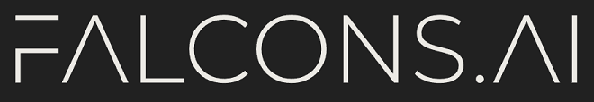
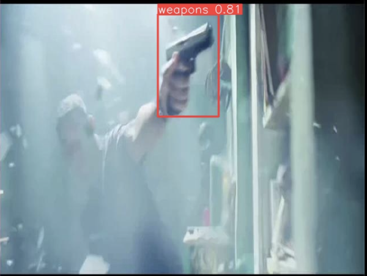
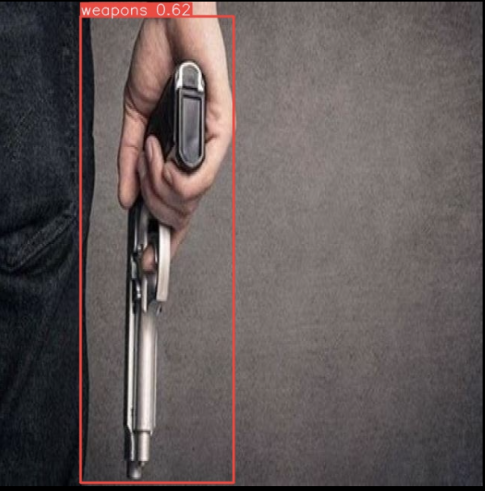
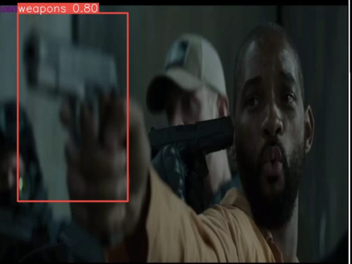

# Weapon Detection Yolov8 Trainer

<!-- PROJECT LOGO -->
 

  

## Weapon Detection Yolov8 Trainer:
 
Welcome to the Yolo v8 Object Detection for Weapon Detection repository! This repository contains a Jupyter Notebook that guides you through the process of training an end-to-end weapon detection model using Yolo v8 Object Detection. This notebook provides a step-by-step guide to train a powerful image classifier for weapons detection at a basic level.

We at Falcons.ai have invested considerable effort in putting together this Jupyter Notebook with the aim of making it easy for you to use and follow. We hope that this resource will be helpful in your efforts to create a weapon detection model.

## Dataset:
https://app.roboflow.com/mike-ovbzu/weapons_detection-tsdac/8

## Training
- ** Please check the batch size as you may need to reduce it substantially depending on your GPU.
- The Jupyter Notebook will guide you through the training process, including setting up the configuration, data augmentation, and running the training procedure. Be patient, as training a Yolo v8 model can take a considerable amount of time, depending on your dataset and hardware.

## Evaluation and Inference
After training, you can evaluate the model's performance and use it for inference on new images.

## Inference Output 

  
  
  

## Acknowledgments
We would like to express our gratitude to the Ultralytics and the community and all the contributors who have made this powerful object detection tool available to the public.

We hope you find this repository useful and that it helps you in your efforts to create a weapon detection model. If you have any questions or run into issues, please feel free to open an issue or contact us.

(<a href="#top">back to top</a>)

## Contributing

Contributions are what make the open source community such an amazing place to learn, inspire, and create. Any contributions you make are **greatly appreciated**.

If you want, feel free to fork this repository. You can also simply open an issue with the tag "enhancement".
Don't forget to give the project a star! Thanks again!

1. Fork the Project
2. Create your Feature Branch (`git checkout -b feature/YourFeature`)
3. Commit your Changes (`git commit -m 'Add some YourFeature'`)
4. Push to the Branch (`git push origin feature/YourFeature`)
5. Open a Pull Request
 
See the https://github.com/Falcons-ai/weapons_detection_trainer_yolov8_open/issues for a full list of proposed features (and known issues).

<!-- LICENSE -->
## License

(<a href="#top">back to top</a>)

<!-- CONTACT -->
## Contact

Project Link: 

(<a href="#top">back to top</a>)

